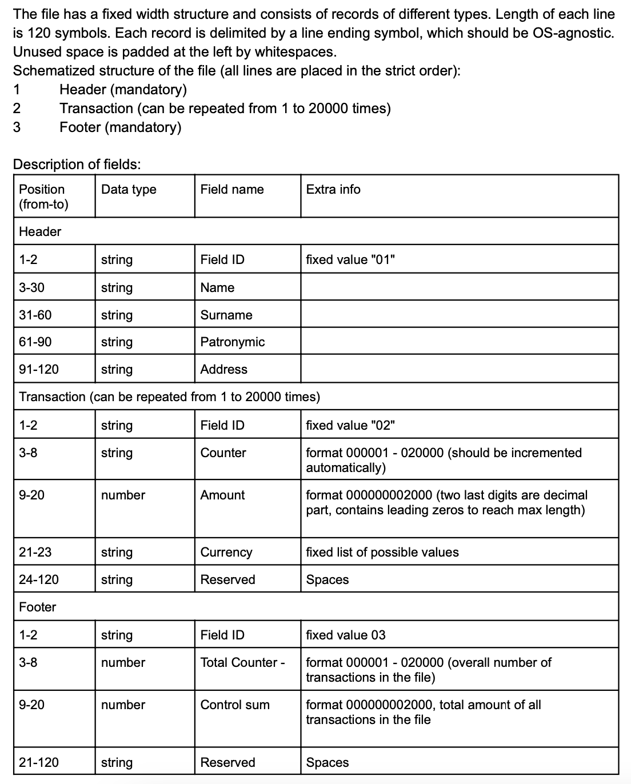

# File Processor

## Library to read, write and modify text files of fixed width format.

### Main elements are:
- `FileProcessor` - functionalities to read, write and modify text files of fixed width format
- `CLI` - `main.py` - Command Line Itterface to easily interact with the FileProcessor via Terminal.
- Automated `Unit Tests` using _pytest_.

### Additional functionalities:
- `generate.py` - to generate the files anligned with the target structure!

## To begin your journey:
1. `pip install -r requirements.txt`
2. `python -m file_processor.main --help` to explore the possibilites!

### Structure of the files:
